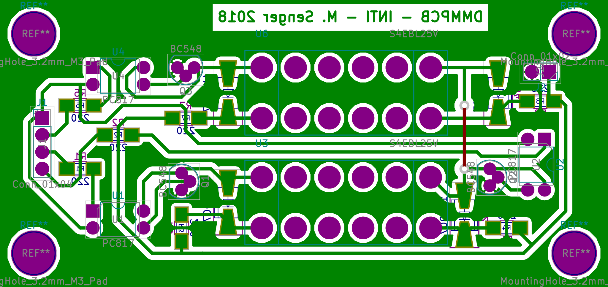

# voltage-scanner-pcb-dmmpcb

[KiCad](http://kicad-pcb.org/) project for the DMMPCB board. This board implements the handling of the voltmeter. The schematic of this board can be found in [this link](export/DMMPCB.pdf). Below is the layout.

